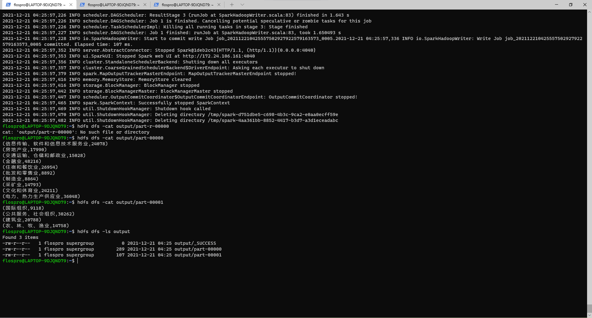
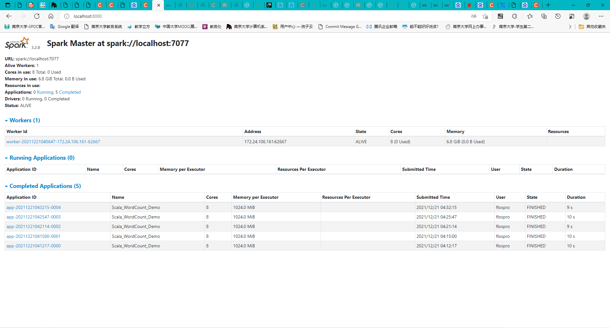

# FBDPex4

环境：

spark-3.2.0

scala-2.12.15

WSL idea

除了Q1，只使用Scala作为编程语言

## Spark配置

参考https://www.cnblogs.com/qingyunzong/p/8903714.html 伪分布式安装


spark-env.sh


## 环境配置时遇到的问题简述

- spark-shell中有创建好的sc环境，在shell中不需要额外创建
- mavne中应删除mapreduce相关依赖，否则会发生io.netty.buffer的冲突，参考https://stackoverflow.com/questions/50055656/java-sparkcontext-error-java-lang-nosuchmethoderror-io-netty-buffer-pooledbyte
- idea configuration中的application连接spark不再好用，应使用spark submit
- 即使在idea configuration中使用spark submit，仍然提醒sun.nio之类的报错，说明从spark集群外部连接集群还存在一定问题，应该从wsl内部处理
- 即使在wsl中spark submit 也出现了scala.reflect的没有该方法的报错，检查后发现，对于spark-3.2.0，还是使用scala-2.12.x更好，scala-2.13还是会出问题
- 改完scala-2.12.15后，出现了9000端口连不上的情况，这是因为在测试用的示例程序中路径前没有指明文件系统，会默认为hdfs，若不修改程序，启动配置好hdfs即可





成功运行示例.

​	简述一下我的scala程序运行方式：结合一步步在spark-shell中的验证，在idea中写好Scala object，打成jar包，由wsl直接通过mnt挂载执行jar包。

## Q1

> 编写 MapReduce 程序，统计每个⼯作领域 industry 的⽹贷记录的数量，并按数量从⼤到⼩进⾏排序

​	为了减少工作量，使用了python（label_attract.py）对原始csv文件进行处理，提取出industry输出到tra_industry_data.csv;

> ```shell
> Usage: indCount <in> <out>
> ```

​	在indCount中使用两个job完成统计与排序。第一个job就是wordcount。需要注意的是，为了第二个job能够接收第一个的中间文件进行处理，需要设置job.setOutputFormatClass(SequenceFileOutputFormat.class);，相应的第二个job中设置sortJob.setInputFormatClass(SequenceFileInputFormat.class);；

​	第二个job中map使用了hadoop.mapreduce.lib.map提供的已有的InverseMapper，将第一个job的结果<⼯作领域> <记录数量>反过来，传到reducer中排好序之后，再在reducer中翻个位置直接输出即可。

## Q2

> 编写 Spark 程序，统计⽹络信⽤贷产品记录数据中所有⽤户的贷款⾦额 total_loan 的分布情况。 以 1000 元为区间进⾏输出。

一言以蔽之：

```scala
val res = temp2.map(_.toDouble/1000.0).map(x=>scala.math.round(scala.math.floor(x))*1000)
.map(x => ((x, x+1000),1)).reduceByKey(_+_).sortByKey()
```

取下界，+1000，再MR。

```shell
Usage:
spark-submit --class "Q2.LoadCSVScalaExample" --master <spark master> Q2.jar <in> <out>
```

部分参考：

https://blog.csdn.net/bowenlaw/article/details/105198202
https://blog.csdn.net/iteye_6988/article/details/82644211


## Q3

部分参考：

https://spark.apache.org/docs/latest/sql-data-sources-csv.html

https://stackoverflow.com/questions/46863360/spark-count-percentage-percentages-of-a-column-values

https://spark.apache.org/docs/latest/sql-getting-started.html#starting-point-sparksession

### T1

> 统计所有⽤户所在公司类型 employer_type 的数量分布占⽐情况。

一言以蔽之：

```scala
val res = df.groupBy("employer_type").count().
withColumn("fraction",col("count")/sum("count").over()).sort(desc("fraction"))
.drop("count")
```

groupBy+count统计数量，withColumn计算比率，sort排序，drop收尾。

```shell
Usage:spark-submit --class "Q3.EmployerType" --master <spark master> Q3_1.jar <in> <out>
```


### T2

> 统计每个⽤户最终须缴纳的利息⾦额。

一言以蔽之：

```scala
val sqlDF = 
spark.sql("select user_id, year_of_loan*monthly_payment*12-total_loan as total_money from df")
```

直接使用sql语言计算。

```shell
Usage: spark-submit --class "Q3.TotalMoney" --master <spark master> Q3_2.jar <in> <out>
```


### T3

> 统计⼯作年限 work_year 超过 5 年的⽤户的房贷情况 censor_status 的数量分布占⽐情况。

观察数据：


分三步（中间记得建立临时视图）

```scala
val temp = spark.sql("select user_id,censor_status,work_year from df where work_year is not null")
```

先过滤work_year为空的行；


```scala
val temp2 = spark.sql("select user_id,censor_status,regexp_extract(work_year,'[0-9]+',0) work_year_No from temp")
```

再利用正则表达式提取数值；


```scala
val res = spark.sql("select user_id,censor_status,if(work_year_No=10,concat(work_year_No,'+'),work_year_No) work_year from temp2 where work_year_No>5")
```

最后过滤出超过5年的，再针对10年加个“+”。


```shell
Usage:spark-submit --class "Q3.WorkYear" --master <spark master> Q3_3.jar <in> <out>
```

## Q4

部分参考：

https://stackoverflow.com/questions/42532347/how-to-convert-all-column-of-dataframe-to-numeric-spark-scala

注意：val不可变，var可变

> 根据给定的数据集，基于 Spark MLlib 或者Spark ML编写程序预测有可能违约的借贷⼈，并评估实验结果的准确率。 数据集中 is_default 反映借贷⼈是否违约。

观察数据：


只有20%的违约，属于数据不平衡问题。使用LR：

```scala
Usage:spark-submit --class "Q4.LogisticRegressionSummaryExample" --master <spark master> <in>
```

简单地使用了欠采样方法：

```scala
def balanceDataset(dataset: DataFrame): DataFrame = {

    val numPositives = dataset.filter(dataset("label") === 1).count
    val datasetSize = dataset.count
    val balancingRatio = (datasetSize - numPositives).toDouble / datasetSize

    val calculateWeights = udf { d: Double =>
      if (d == 1.0) {
        1 * balancingRatio
      }
      else {
        (1 * (1.0 - balancingRatio))
      }
    }

    val weightedDataset = dataset.withColumn("classWeightCol", calculateWeights(dataset("label")))
    weightedDataset
  }
```

并主观筛掉了一些属性，如：

```scala
 val temp2 = temp.drop("loan_id","user_id","initial_list_status", "early_return","earlies_credit_line","early_return_amount","early_return_amount_3mon", "policy_code","title","initial_list_status","earlies_credit_mon","pub_dero_bankrup", "scoring_high","post_code","issue_date","censor_status","sub_class")
```

针对一些重要参数进行了字符串到数值序号的转变，如：

```scala
val indexer_ind = new StringIndexer().setInputCol("industry").setOutputCol("industry_index")
val indexed_ind = indexer_ind.fit(indexed_et).transform(indexed_et).drop("industry")
val indexed_wy = indexed_ind.withColumn("work_year_extract",regexp_extract(col("work_year"),"[0-9]+",0)).drop("work_year")

val castedDF = indexed_wy.columns.foldLeft(indexed_wy)((current, c) => current.withColumn(c, col(c).cast("float")))
```

对部分缺少的数据使用了插值：

```scala
val imputer = new Imputer().setInputCols(castedDF.columns).setOutputCols(castedDF.columns.map(c => s"${c}_imputed")).setStrategy("mode")
val fin = imputer.fit(castedDF).transform(castedDF)
```

将除label和权重外所有属性设为feature，对模型进行训练：

```scala
val assembler = new VectorAssembler().setInputCols(Array("total_loan_imputed","year_of_loan_imputed","interest_imputed","monthly_payment_imputed","house_exist_imputed","house_loan_status_imputed","marriage_imputed","offsprings_imputed","use_imputed","region_imputed","debt_loan_ratio_imputed","del_in_18month_imputed","scoring_low_imputed","recircle_b_imputed","recircle_u_imputed","f0_imputed","f1_imputed","f2_imputed","f3_imputed","f4_imputed","f5_imputed","work_type_index_imputed","class_index_imputed","employer_type_index_imputed","industry_index_imputed","work_year_extract_imputed")).setOutputCol("features")
......
val lr = new LogisticRegression().setMaxIter(10).setRegParam(0.3).setElasticNetParam(0.8).setWeightCol("classWeightCol").setLabelCol("label").setFeaturesCol("features")
val lrModel = lr.fit(output)
```

最终展示了loss、ROC、F-measure等评价指标：


可见F-measure不是很高，AUC=0.5也意味着比随机预测好不了多少，主要是出于欠采样、插值、数据预处理、学习算法选择等步骤的粗粒度处理。此次实验将一定精力放在了语法上，并没有针对数据进行好的预处理和算法选择仅仅走了个完整的形式，故精度较低。
